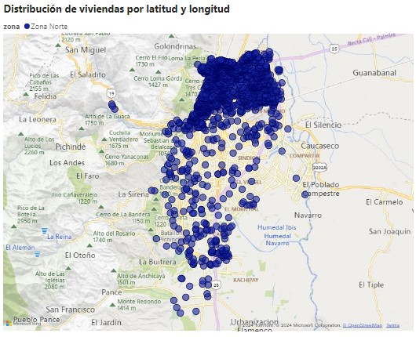
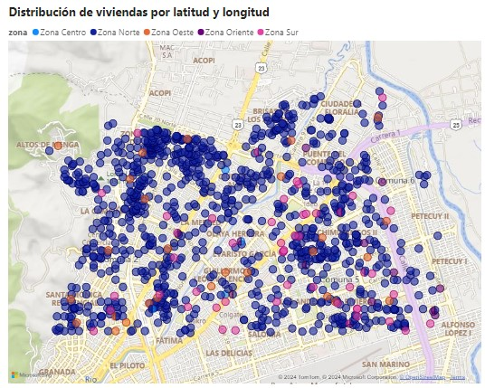
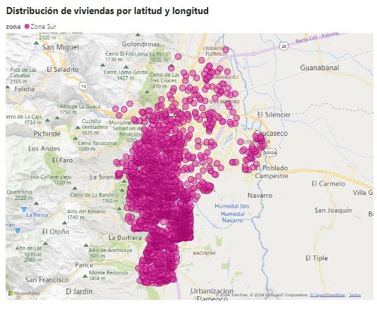
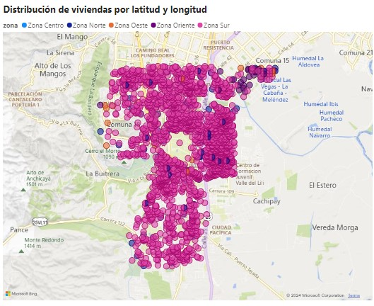

```{r setup, include=FALSE}
knitr::opts_chunk$set(echo = TRUE)
```

```{r, include=FALSE}
library(paqueteMETODOS)
library(lmtest)
library(stargazer)
library(dplyr)
library(mice)
library(visdat)
library(plotly)
library(reshape2)
data(vivienda)
```

### 1.1. Introducción
El presente informe busca comprender los factores que determinan el precio de una vivienda con ciertas características definidas. De esta forma, la idea es adentrarse en el análisis del precio de viviendas en las zonas norte y sur dependiendo de las necesidades concretas del cliente.

A través de un conjunto de datos denominado "vivienda", que tien información detallada sobre diversas viviendas, este estudio busca identificar la relación entre el precio de la vivienda y las variables de área construida, estrato, número de cuartos, número de parqueaderos, número de baños mediante un modelo de regresión múltiple.

### 1.2. Metodología
Para alcanzar los objetivos planteados, se empleará la siguiente metodología:

- *Análisis exploratorio de datos:* Se explorarán los datos del conjunto "vivienda" para comprender su distribución, identificar posibles valores atípicos y visualizar la relación entre las variables de interés (precio, área construida, estrato, número de cuartos, número de parqueaderos, número de baños).
- *Modelado estadístico:* Se aplicará modelo de regresión lineal míltiple para identificar el que mejor se ajuste a los datos y explique la relación entre el precio y las variables en mención.
- *Evaluación del modelo:* Se evaluará el rendimiento de cada modelo estadístico utilizando métricas adecuadas, como el coeficiente de determinación (R²) y la validación de supuestos estadísticos.

### 1.3. Resultados
De acuerdo al estudio realizado, la relación entre el precio de una vivienda estrato 4 en Cali y su área construida, según análisis descriptivos proporcionados en los anexos demuestran una relación positiva y creciente. Lo cual tiene sentido en tanto que a mayor tamaño de vivienda, se espera que su precio sea mayor. El modelo estadístico de regresión lineal simple permitió ajustar el precio de una vivienda con mayor precisión en función de su tamaño, facilitando la toma de decisiones informadas en el mercado inmobiliario local. En la gráfica que se muestra a continuación se puede evidenciar cómo están relacionados los datos y el modelo aplicado sobre los apartamentos de estrato 4 dentro de los datos de muestra:

```{r echo=FALSE}
```
El en gráfico propuesto se da a conocer gráficamente la relación entre las dos variables de estudio. Como se esperaba, los datos presentan una relación creciente positiva, el modelo propuesto que permite conocer el impacto de cuánto puede llegar a crecer el precio en función del área de un bien. El modelo de regresión lineal sencillo se realizó usando como variable dependiente el precio en millones y el área construida en metros cuadrados como variable independiente o explicativa. Los datos sobre el modelo de regresión utilizado se pueden encontrar en la siguiente tabla:

``` {r echo=FALSE}
# stargazer(modelo_regresion, type = "text")
```

Sobre el modelo de regresión simple, se puede interpretar que el 71.63% de la variabilidad en la variable dependiente (precio en millones) está explicada por la variable independiente (area construida en metros cuadrados). Esto significa que el modelo propuesto captura una porción considerable de la variabilidad en el precio que puede ser atribuida a la relación con el área de construcción de una propiedad. Además, con base en el análisis de los estadísticos de regresión y las pruebas de hipótesis, se puede concluir que los coeficientes del modelo son estadísticamente significativos para el modelo de regresión. Esto implica que las variables independientes correspondientes tienen un efecto significativo en la predicción de la variable dependiente.

Es clave también destacar que el modelo propuesto en este análisis cumple con los supuestos de homocedasticidad, autocorrelación y normalidad en los errores. En primer lugar, la homocedasticidad, que implica que la varianza de los errores es constante en todos los niveles de la variable independiente, se verifica mediante pruebas estadísticas adecuadas, como el test de Breusch-Pagan, que no encontró evidencia significativa de heterocedasticidad en los residuos del modelo. Además, la autocorrelación, que indica la falta de independencia entre los errores, se evaluó a través del test de Durbin-Watson, que no encontró evidencia de autocorrelación en los residuos del modelo. Por último, la normalidad en los errores, que supone que los errores se distribuyen normalmente, se verificó mediante el test de Shapiro-Wilk, que no encontró evidencia significativa de desviación de una distribución normal en los residuos del modelo. Estos resultados indican que el modelo de regresión lineal simple utilizado en este análisis satisface los supuestos fundamentales necesarios para realizar inferencias válidas y confiables sobre la relación entre las variables. Los resultados aquí mencionados se pueden validar en la sección 2.7 del apartado de anexos.

### 1.4. Conclusiones
Este informe contribuye a una mejor comprensión de los factores que determinan el precio de las viviendas en Cali, particularmente en el segmento de estrato 4 con un área construida inferior a 200 metros cuadrados. La identificación de un modelo estadístico que describe la relación entre el precio y el área construida permite a los actores del mercado inmobiliario tomar decisiones más acertadas en sus transacciones

La alta proporción de variabilidad en el precio de una propiedad explicada por el área construida (71.63%) sugiere que el modelo de regresión lineal simple es una herramienta útil para predecir el precio de una propiedad basándose en su área de construcción. Esta relación significativa entre el área construida y el precio proporciona una base sólida para estimar el valor de las propiedades.

El hecho de que los coeficientes del modelo sean estadísticamente significativos implica que el área construida tiene un efecto significativo en la predicción del precio de una propiedad. Esto sugiere que, en promedio, por cada unidad adicional de área construida, el precio de la propiedad aumenta o disminuye de manera significativa. Esta información es crucial para los agentes del mercado inmobiliario y los inversores que deseen comprender cómo varía el precio de una propiedad en función de su tamaño.

Dado que el modelo captura una porción considerable de la variabilidad en el precio de una propiedad y los coeficientes son estadísticamente significativos, puede ser una herramienta valiosa para la toma de decisiones en el mercado inmobiliario. Los agentes del mercado, los tasadores de propiedades y los compradores potenciales pueden utilizar este modelo para estimar el precio de las propiedades y tomar decisiones informadas sobre la compra, venta o valoración de bienes raíces.

\newpage

## 2. Anexos

### 2.1. Filtro a la base de datos (zona norte):

Se procede a realizar un filtro a la base de datos usando la variable `tipo` para verificar las casas y la variable `zona` para identificar las que se encuentran en la Zona Norte. Se hace la visualización de las primeras tres líneas:
```{r}
cond_vector <- (vivienda$tipo == "Casa") & (vivienda$zona == "Zona Norte")
viviendas_norte <- subset(vivienda, cond_vector)
head(viviendas_norte, 3)
```

Así mismo, se realiza la gráfica de los registros con ubicaciones en zona norte, lo que genera como resultado la siguiete imagen, la cual fue realizada utilizando PowerBI:

```{r echo=FALSE}

```

Se evidencia que existen varios registros que están por fuera de la zona norte. Como resultado de este hallazgo, se propone elegir puntos estratégicos con base en la observación de la gráfica y el conocimiento de las zonas, para definir límites estrictos y poder tomar la base de datos de una mejor manera.

Así pues, el filtro arbitrario se generará de la siguiente manera:

* Latitudes mayores a 3.46467 (para sur menores a: 3.40282)
* Longitudes mayores a -76.5354 

Para que el nuevo mapa quede de la siguiente manera. Para efectos ilustrativos se están dejando las anteriores categorizaciones de las zonas, aunque para nuestro ejercicio se van a tomar estos puntos como ZONA NORTE:

```{r echo=FALSE}

```

 
Por lo tanto, nuestra nueva consulta para trabajo, llamada `viviendas_norte` será la calculada con el siguiente código:


```{r}
cond_vector <- (vivienda$tipo == "Casa") & (vivienda$latitud > 3.46467) & (vivienda$longitud > -76.5354)
viviendas_norte <- subset(vivienda, cond_vector)
cat("Cantidad columnas: ", ncol(viviendas_norte), "Cantidad filas: ", nrow(viviendas_norte))
head(viviendas_norte, 3)
```

Se hace el slice por variables de interés para nuestro ejercicio:

```{r}
interest_cols <- c("preciom", "areaconst", "estrato", "banios", "habitaciones")
viviendas_norte <- viviendas_norte[, interest_cols] 
viviendas_norte
```


### 2.2. Análisis exploratorio:

Análisis exploratorio de datos, enfocado en la relación entre la variable respuesta (precio) en función de las variables predictoras (área construida, estrato, número de cuartos, número de parqueaderos, número de baños)

Boxplot para verificar la relación entre el `estrato` (variable categórica ordinal) y `preciom`:

```{r}
# Se convierte estrato a un factor para evitar que se considere una variable numérica
# viviendas_norte$estrato <- factor(viviendas_norte$estrato, ordered = TRUE)
viviendas_norte$estrato <- as.character(viviendas_norte$estrato)

# Create box plot
plot <- plot_ly(viviendas_norte, x = ~estrato, y = ~preciom, type = 'box') %>%
  layout(title = "Precio vs. Estrato")

plot
```


En la gráfica de boxplot se puede verificar la relación entre el estrato con respecto al precio de la vivienda. Se puede evidenciar la existencia de outliers para viviendas (casas, zona norte) de estrato 3. Las viviendas estrato 6 tienen un precio más alto en promedio siendo su mediana 850 millones, comparado con viviendas estrato 5 con precio mediano de 450 millones y estrato 4 con precio mediano de 367 millones.

Gráfico de dispersión para visualizar la relación entre el área construida y el precio de la vivienda

```{r}
# Crear un gráfico de dispersión de precio vs. área construida
plot <- plot_ly(viviendas_norte, x = ~areaconst, y = ~preciom,
                type = 'scatter', mode = 'markers',
                marker = list(color = 'blue'))

# Agregar título y etiquetas
plot <- plot %>% layout(title = "Relación entre Precio y Área Construida",
                       xaxis = list(title = "Área Construida"),
                       yaxis = list(title = "Precio"))

plot
```


La gráfica sugiere que exite una relación lineal positiva entre el precio por metro cuadrado y la cantidad de metros cuadrados construidos de la vivienda. Lo cual tiene sentido práctico y lógico, en cuanto que una vivienda sea más grande mayor tiende a ser su precio.


Matriz de correlación para realizar una visualización de la interacción de las variables con respecto a nuestra variable objetivo (preciom) y entre dependientes:
``` {r}
# Crear una matriz de correlación excluyendo "estrato"
corr_matrix <- cor(viviendas_norte[, -which(names(viviendas_norte) == "estrato")])

# Visualizar la matriz de correlación como un mapa de calor
plot_ly(z = corr_matrix, x = colnames(corr_matrix), y = colnames(corr_matrix),
        type = "heatmap", colorscale = "Inferno") %>%
  layout(title = "Matriz de Correlación")
```


Según lo observado en la visualización, se confirma la fuerte asociación que existe entre el precio de la vivienda y el área construida con una correlación positiva de 0.78. Así mismo, existe una correlación con los baños de la casa y el precio de 0.57, lo cual también es un índice alto. Las habitaciones son las que menos correlación poseen con respecto al precio, con un coeficiente de 0.35, la cual es la más baja de todas, pero no se podría subestimar por el momento.


### 2.3. Modelo de regresión lineal múltiple:

Aplicación del modelo de regresión lineal múltiple para realizar el ajuste de la variable `preciom`:

```{r}
# Ajustar el modelo de regresión lineal múltiple
reg_model <- lm(preciom ~ ., data = viviendas_norte)

# Resumen del modelo
summary(reg_model)
```

**Interpretaciones de los valores obtenidos:**
* Intercept : Representa el precio promedio de una vivienda cuando todas las variables predictoras son cero. Sin embargo, es poco probable que una vivienda tenga un área construida, baños y habitaciones igual a cero. Este valor sirve principalmente como punto de referencia para la interpretación de los otros coeficientes.

* areaconst: Por cada metro cuadrado adicional de área construida, el precio de la vivienda aumenta en promedio 0.8469 unidades monetarias, manteniendo constantes las demás variables. Este coeficiente es altamente significativo (p < 0.001), lo que indica una fuerte relación positiva entre el área construida y el precio.

* estrato4, estrato5, estrato6: Estos coeficientes representan la diferencia en el precio promedio de una vivienda en comparación con el estrato base (estrato3), cuando todas las demás variables se mantienen constantes. Por ejemplo, una vivienda en el estrato 4 es, en promedio, 76.4058 unidades monetarias más cara que una vivienda en el estrato base.

* banios (23.0237): Por cada baño adicional, el precio de la vivienda aumenta en promedio 23.0237 unidades monetarias, manteniendo constantes las demás variables. Este coeficiente también es altamente significativo, lo que sugiere una fuerte relación positiva entre el número de baños y el precio.

* habitaciones (4.9699): El coeficiente es positivo, pero no es estadísticamente significativo (p = 0.289861). Esto indica que no hay evidencia suficiente para concluir que el número de habitaciones tenga un impacto significativo en el precio de las viviendas, al menos cuando se consideran las otras variables en el modelo.

* R-cuadrado (0.715): Indica que el modelo explica aproximadamente el 71.5% de la variabilidad en el precio de las viviendas. Este es un valor relativamente alto, lo que sugiere que el modelo se ajusta razonablemente bien a los datos.

**Mejoras posibles en el ajuste del modelo:**

* El hecho de que el coeficiente de "habitaciones" no sea significativo podría deberse a varias razones: alta correlación con otras variables (multicolinealidad), poca variabilidad en el número de habitaciones en los datos, o simplemente que el número de habitaciones no sea un factor tan importante en la determinación del precio en esta muestra particular.


### 2.4. Validación de supuestos
Validación de los supuestos del modelo por medio de gráficos apropiados, interpretarlos y sugerir posibles soluciones si se violan algunos de ellos. Utilizar las pruebas de hipótesis para la validación de supuestos y comparar los resultados con lo observado en los gráficos asociados:

- **Normalidad de los errores**
``` {r}
res = resid(reg_model)
shapiro.test(res)
```

Analizando el p-value de la prueba, que es muy pequeño, se puede decir que se rechaza la hipótesis nula de que los datos provienen de una distribución normal. Lo que quiere decir que los errores pueden ser no normalmente distribuidos, lo que viola el supuesto que se está comprobando. Este resultado tiene implicaciones dado que se puede afectar la validez de las inferencias estadísticas.

Este hecho se podría intentar solucionar realizando trasnformaciones sobre los datos, la más común en su aplicación es el logaritmo. Aunque se pueden utilizar otro tipo de transformaciones, como raíces cuadradas, entre otros. 


- **Heterocedasticidad en los errores**
``` {r}
lmtest::bptest(reg_model)
```
Dado que el p-valor es significativamente menor que 0.05, se rechaza la hipótesis nula de homocedasticidad. Esto sugiere que existe evidencia de heterocedasticidad en los residuos del modelo de regresión. La violación de este supuesto, como en la normalidad de los errores, sugiere que las pruebas estadísticas que se apliquen pierden poder explicativo, por lo tanto las estimaciones de los coeficientes y sus errores estándar pueden ser sesgados.

Los pasos a seguir sugeridos pueden ser crear gráficos de residuos para identificar patrones de heterocedasticidad visualmente.Y considerar transformaciones de las variables dependiente o independientes para reducir la heterocedasticidad. Las transformaciones pueden ayudar como en el punto anterior.


- Autocorrelación en los errores
``` {r}
lmtest::dwtest(reg_model)
```
Como el p-valor es significativamente menor que 0.05, se rechaza la hipótesis nula de ausencia de autocorrelación. Esto sugiere que existe evidencia de autocorrelación positiva de primer orden en los residuos del modelo de regresión. La autocorrelación puede invalidar las inferencias estadísticas basadas en el modelo de regresión. Las estimaciones de los coeficientes y sus errores estándar pueden ser sesgados

Para poder arreglar este tipo de situaciones se puede considerar transformaciones de las variables dependiente o independiente para reducir la autocorrelación. Así mismo la literatura suguiete usar modelos autorregresivos como los modelos de regresión autorregresivos (AR) o modelos de media móvil (MA) para incorporar la autocorrelación en el modelo.

- Gráficamente:
``` {r}
par(mfrow=c(1,2))
qqnorm(res)
qqline(res)
hist(res, main = "Histograma de Residuos")
```
Como se puede observar en las gráficas, los datos no siguen una distribución normal, la distribución de los datos es asimétrica y presenta colas más pesadas o más ligeras que una distribución normal. Además, la distribución es no lineal, sino que la relación entre los cuantiles de los datos y los cuantiles de una distribución normal no es lineal, sino que sigue un patrón curvilíneo.

### 2.5. Predicción usando las características de la primera solicitud:
Con el modelo identificado debe predecir el precio de la vivienda con las características de la primera solicitud:

```{r}
data_to_pred <- data.frame(
  areaconst = 200,
  parqueaderos = 1,
  estrato = c("4", "5"),
  banios = 2,
  habitaciones = 4
)

predict(reg_model, data_to_pred, level = 0.95, interval = "confidence")
```
De acuerdo con el modelo, se estima que una vivienda unifamiliar de 200 m² ubicada en el estrato 4 de la zona norte, con las características descritas, tendrá un valor promedio de mercado de 333.89 millones. Con un nivel de confianza del 95 %, se espera que el precio real se encuentre entre 302.88 y 364.90 millones. Para una vivienda similar ubicada en el estrato 5, el valor promedio estimado asciende a 370.04 millones, con un intervalo de confianza del 95% que oscila entre 342.52 y $397.56 millones.


### 2.6. Generación de modelo usando train-test split:

```{r}
set.seed(1)

# Dividir el conjunto de datos en entrenamiento y prueba
smp_size <- floor(0.70 * nrow(viviendas_norte))
train_ind <- sample(seq_len(nrow(viviendas_norte)), size = smp_size)
train_data <- viviendas_norte[train_ind, ]
test_data <- viviendas_norte[-train_ind, ]

# Crear y entrenar el modelo de regresión lineal
model_test <- lm(preciom ~ ., data = train_data)
summary(model_test)
```

El resultado que se muestra en el resumen del modelo significa que aproximadamente el 67.08% de la variación en los precios de las viviendas puede ser explicada por las variables independientes incluidas en el modelo. Lo que nos da un ajuste bueno pero no superior con respecto a la capacidad de explicación de las variables. Un valor más alto indicaría un mejor ajuste del modelo a los datos.


```{r}
# Hacer predicciones en el conjunto de prueba
predicciones <- predict(model_test, newdata = test_data)

# Evaluar el modelo
rmse <- sqrt(mean((predicciones - test_data$preciom)^2))
cat("Error cuadrático medio (RMSE):", rmse, "\n")
```
Un RMSE de 107.6541 significa que, en promedio, las predicciones del modelo se desvían del valor real en 107.6541 unidades. Como la variable objetivo es `preciom`, significa que en promedio las predicciones del modelo se desvían 107 millones de pesos. Considerando que las viviendas tienen un precio entre 300 a casi 800 millones de pesos, el error promedio esperado puede ser de más de cien millones de pesos. En este caso puede no considerarse un modelo muy efectivo en la estimación dado que tiene problemas para realizar predicciones precisas aunque su ajuste (R2) sea aproximadamente 70 %.

```{r}
# Evaluar el modelo
mae <- mean(predicciones - test_data$preciom)
cat("Error Absoluto Medio (MAE):", mae, "\n")
```
Un Error Absoluto Medio (MAE) de 7.97 millones de pesos en un modelo de predicción significa que, en promedio, las predicciones de están desviadas de los precios reales en 7.975118 millones de pesos. Es decir, si se toma la diferencia absoluta entre el precio real de una vivienda y el precio que el modelo predice para esa misma vivienda, y  se calcula el promedio de todas esas diferencias se obtiene el valor de 7 millones de pesos.


## 3. Anexos zona sur

### 3.1. Filtro a la base de datos (zona sur):

Se procede a realizar un filtro a la base de datos usando la variable `tipo` para verificar los apartamentos y la variable `zona` para identificar las que se encuentran en la Zona Sur Se hace la visualización de las primeras tres líneas:
```{r}
cond_vector <- (vivienda$tipo == "Apartamento") & (vivienda$zona == "Zona Sur")
viviendas_sur <- subset(vivienda, cond_vector)
head(viviendas_sur, 3)
```

Así mismo, se realiza la gráfica de los registros con ubicaciones en zona sur, lo que genera como resultado la siguiete imagen, la cual fue realizada utilizando PowerBI:

```{r echo=FALSE}

```

Se evidencia que existen varios registros que están por fuera de la zona sur, en general la mayoría. Como resultado de este hallazgo, se propone elegir puntos estratégicos con base en la observación de la gráfica y el conocimiento de las zonas, para definir límites estrictos y poder tomar la base de datos de una mejor manera.

Así pues, el filtro arbitrario se generará de la siguiente manera:

* Latitudes menores a: 3.40282

Para que el nuevo mapa quede de la siguiente manera. Para efectos ilustrativos se están dejando las anteriores categorizaciones de las zonas, aunque para nuestro ejercicio se van a tomar estos puntos como ZONA SUR:

```{r echo=FALSE}

```

 
Por lo tanto, nuestra nueva consulta para trabajo, llamada `viviendas_sur` será la calculada con el siguiente código:


```{r}
cond_vector <- (vivienda$tipo == "Apartamento") & (vivienda$latitud < 3.40282)
viviendas_sur <- subset(vivienda, cond_vector)
cat("Cantidad columnas: ", ncol(viviendas_sur), "Cantidad filas: ", nrow(viviendas_sur))
head(viviendas_sur, 3)
```

Se hace el slice por variables de interés para nuestro ejercicio:

```{r}
interest_cols <- c("preciom", "areaconst", "estrato", "banios", "habitaciones")
viviendas_sur <- viviendas_sur[, interest_cols] 
viviendas_sur
```


### 3.2. Análisis exploratorio:

Análisis exploratorio de datos, enfocado en la relación entre la variable respuesta (precio) en función de las variables predictoras (área construida, estrato, número de cuartos, número de parqueaderos, número de baños)

Boxplot para verificar la relación entre el `estrato` (variable categórica ordinal) y `preciom`:

```{r}
# Se convierte estrato a un factor para evitar que se considere una variable numérica
# viviendas_sur$estrato <- factor(viviendas_sur$estrato, ordered = TRUE)
viviendas_sur$estrato <- as.character(viviendas_sur$estrato)

# Create box plot
plot <- plot_ly(viviendas_sur, x = ~estrato, y = ~preciom, type = 'box') %>%
  layout(title = "Precio vs. Estrato")

plot
```


En la gráfica de boxplot se puede verificar la relación entre el estrato con respecto al precio de la vivienda. Se puede evidenciar la existencia de outliers para viviendas (apartamentos, zona sur) de todos los estratos. Los apartamentos estrato 6 tienen un precio más alto en promedio siendo su mediana 580 millones, comparado con apartamentos estrato 5 con precio mediano de 280 millones y estrato 4 con precio mediano de 185 millones.

Gráfico de dispersión para visualizar la relación entre el área construida y el precio del apartamento

```{r}
# Crear un gráfico de dispersión de precio vs. área construida
plot <- plot_ly(viviendas_sur, x = ~areaconst, y = ~preciom,
                type = 'scatter', mode = 'markers',
                marker = list(color = 'blue'))

# Agregar título y etiquetas
plot <- plot %>% layout(title = "Relación entre Precio y Área Construida",
                       xaxis = list(title = "Área Construida"),
                       yaxis = list(title = "Precio"))

plot
```


La gráfica sugiere que exite una relación lineal positiva entre el precio por metro cuadrado y la cantidad de metros cuadrados construidos de la vivienda. Lo cual tiene sentido práctico y lógico, en cuanto que un apartamento sea más grande mayor tiende a ser su precio.

Matriz de correlación para realizar una visualización de la interacción de las variables con respecto a nuestra variable objetivo (preciom) y entre dependientes:
``` {r}
# Crear una matriz de correlación excluyendo "estrato"
corr_matrix <- cor(viviendas_sur[, -which(names(viviendas_sur) == "estrato")])

# Visualizar la matriz de correlación como un mapa de calor
plot_ly(z = corr_matrix, x = colnames(corr_matrix), y = colnames(corr_matrix),
        type = "heatmap", colorscale = "Inferno") %>%
  layout(title = "Matriz de Correlación")
```


Según lo observado en la visualización, se confirma la fuerte asociación que existe entre el precio de la vivienda y el área construida con una correlación positiva de 0.77. Así mismo, existe una correlación con los baños del apartamento y el precio de 0.74, lo cual también es un índice alto. Las habitaciones son las que menos correlación poseen con respecto al precio, con un coeficiente de 0.32, la cual es la más baja de todas, pero no se podría subestimar por el momento.


### 3.3. Modelo de regresión lineal múltiple:

Aplicación del modelo de regresión lineal múltiple para realizar el ajuste de la variable `preciom`:

```{r}
# Ajustar el modelo de regresión lineal múltiple
reg_model_sur <- lm(preciom ~ ., data = viviendas_sur)

# Resumen del modelo
summary(reg_model_sur)
```

**Interpretaciones de los valores obtenidos:**
* Intercept : Representa el precio promedio de una vivienda cuando todas las variables predictoras son cero. Sin embargo, es poco probable que una vivienda tenga un área construida, baños y habitaciones igual a cero. En este caso es negativo y no significativo según la estimación de los resultados del modelo.

* areaconst: Por cada metro cuadrado adicional de área construida, el precio de la vivienda aumenta en promedio 1.6469 unidades monetarias, manteniendo constantes las demás variables. Este coeficiente es altamente significativo (p < 0.001), lo que indica una fuerte relación positiva entre el área construida y el precio.

* estrato4, estrato5, estrato6: Estos coeficientes representan la diferencia en el precio promedio de una vivienda en comparación con el estrato base (estrato3), cuando todas las demás variables se mantienen constantes. Por ejemplo, una vivienda en el estrato 4 es, en promedio, 23.91 unidades monetarias más cara que una vivienda en el estrato base.

* banios: Por cada baño adicional, el precio de la vivienda aumenta en promedio 58.38508 unidades monetarias, millones de pesos en este caso, manteniendo constantes las demás variables. Este coeficiente también es altamente significativo, lo que sugiere una fuerte relación positiva entre el número de baños y el precio.

* habitaciones: El coeficiente es negativo (-14.85644), y resulta ser estadísticamente significativo (p = 0.000418). Esto indica que entre más habitaciones tiene un apartamento en la zona sur de Cali, mayor es su precio. Esto se puede deber a que los apartamentos más costosos y de mayor estrato por lo general tienen menos habitaciones, aunque habría que realizar la validación con la persona experta del negocio.


**Mejoras posibles en el ajuste del modelo:**

* El hecho de que el coeficiente del intercepto no sea significativo podría deberse a que no tiene una interpretación práctica dentro de la lógica del modelo. Entonces se debería excluir para realizar las predicciones.

* Se puede intentar hacer modelaciones distintas para encontrar mejores ajustes de los datos hacia el modelo, por ejemplo transformaciones logaríticas u otro tipo de transformaciones lineales.


### 3.4. Validación de supuestos
Validación de los supuestos del modelo por medio de gráficos apropiados, interpretarlos y sugerir posibles soluciones si se violan algunos de ellos. Utilizar las pruebas de hipótesis para la validación de supuestos y comparar los resultados con lo observado en los gráficos asociados:

- **Normalidad de los errores**
``` {r}
res = resid(reg_model_sur)
shapiro.test(res)
```

Analizando el p-value de la prueba, que es muy pequeño, se puede decir que se rechaza la hipótesis nula de que los datos provienen de una distribución normal. Lo que quiere decir que los errores pueden ser no normalmente distribuidos, lo que viola el supuesto que se está comprobando. Este resultado tiene implicaciones dado que se puede afectar la validez de las inferencias estadísticas.

Este hecho se podría intentar solucionar realizando trasnformaciones sobre los datos, la más común en su aplicación es el logaritmo. Aunque se pueden utilizar otro tipo de transformaciones, como raíces cuadradas, entre otros. 


- **Heterocedasticidad en los errores**
``` {r}
lmtest::bptest(reg_model_sur)
```
Dado que el p-valor es significativamente menor que 0.05, se rechaza la hipótesis nula de homocedasticidad. Esto sugiere que existe evidencia de heterocedasticidad en los residuos del modelo de regresión. La violación de este supuesto, como en la normalidad de los errores, sugiere que las pruebas estadísticas que se apliquen pierden poder explicativo, por lo tanto las estimaciones de los coeficientes y sus errores estándar pueden ser sesgados.

Los pasos a seguir sugeridos pueden ser crear gráficos de residuos para identificar patrones de heterocedasticidad visualmente.Y considerar transformaciones de las variables dependiente o independientes para reducir la heterocedasticidad. Las transformaciones pueden ayudar como en el punto anterior.


- Autocorrelación en los errores
``` {r}
lmtest::dwtest(reg_model_sur)
```
Como el p-valor es significativamente menor que 0.05, se rechaza la hipótesis nula de ausencia de autocorrelación. Esto sugiere que existe evidencia de autocorrelación positiva de primer orden en los residuos del modelo de regresión. La autocorrelación puede invalidar las inferencias estadísticas basadas en el modelo de regresión. Las estimaciones de los coeficientes y sus errores estándar pueden ser sesgados

Para poder arreglar este tipo de situaciones se puede considerar transformaciones de las variables dependiente o independiente para reducir la autocorrelación. Así mismo la literatura suguiete usar modelos autorregresivos como los modelos de regresión autorregresivos (AR) o modelos de media móvil (MA) para incorporar la autocorrelación en el modelo.

- Gráficamente:
``` {r}
par(mfrow=c(1,2))
qqnorm(res)
qqline(res)
hist(res, main = "Histograma de Residuos")
```
Como se puede observar en las gráficas, los datos no siguen una distribución normal, la distribución de los datos es asimétrica y presenta colas más pesadas o más ligeras que una distribución normal. Además, la distribución es no lineal, sino que la relación entre los cuantiles de los datos y los cuantiles de una distribución normal no es lineal, sino que sigue un patrón curvilíneo.

### 3.5. Predicción usando las características de la primera solicitud:
Con el modelo identificado debe predecir el precio de la vivienda con las características de la primera solicitud:

```{r}
data_to_pred <- data.frame(
  areaconst = 300,
  parqueaderos = 3,
  estrato = c("5", "6"),
  banios = 3,
  habitaciones = 5
)

predict(reg_model_sur, data_to_pred, level = 0.95, interval = "confidence")
```
De acuerdo con el modelo, se estima que un apartamento de 300 m² ubicada en el estrato 4 de la zona sur, con las características descritas, tendrá un valor promedio de mercado de 622.64 millones. Con un nivel de confianza del 95 %, se espera que el precio real se encuentre entre 597.91 y 647.37 millones. Para una vivienda similar ubicada en el estrato 5, el valor promedio estimado asciende a 784.49 millones, con un intervalo de confianza del 95% que oscila entre 759.09 y 809.89 millones.


### 3.6. Generación de modelo usando train-test split:

```{r}
set.seed(1)

# Dividir el conjunto de datos en entrenamiento y prueba
smp_size <- floor(0.70 * nrow(viviendas_sur))
train_ind <- sample(seq_len(nrow(viviendas_sur)), size = smp_size)
train_data <- viviendas_sur[train_ind, ]
test_data <- viviendas_sur[-train_ind, ]

# Crear y entrenar el modelo de regresión lineal
model_test_sur <- lm(preciom ~ ., data = train_data)
summary(model_test_sur)
```

El resultado que se muestra en el resumen del modelo significa que aproximadamente el 76.23% de la variación en los precios de los apartamentos puede ser explicada por las variables independientes incluidas en el modelo. Lo que nos da un ajuste bueno pero no superior con respecto a la capacidad de explicación de las variables. Un valor más alto indicaría un mejor ajuste del modelo a los datos.


```{r}
# Hacer predicciones en el conjunto de prueba
predicciones <- predict(model_test_sur, newdata = test_data)

# Evaluar el modelo
rmse <- sqrt(mean((predicciones - test_data$preciom)^2))
cat("Error cuadrático medio (RMSE):", rmse, "\n")
```
Un RMSE de 93.63229  significa que, en promedio, las predicciones del modelo se desvían del valor real en 93.63 unidades. Como la variable objetivo es `preciom`, significa que en promedio las predicciones del modelo se desvían 93 millones de pesos. Considerando que las viviendas tienen un precio entre 84 a casi 750 millones de pesos, el error promedio esperado puede ser de casi cien millones de pesos. En este caso puede no considerarse un modelo muy efectivo en la estimación dado que tiene problemas para realizar predicciones precisas aunque su ajuste (R2) sea aproximadamente 70 %.

```{r}
# Evaluar el modelo
mae <- mean(predicciones - test_data$preciom)
cat("Error Absoluto Medio (MAE):", mae, "\n")
```
Un Error Absoluto Medio (MAE) de 12.82 millones de pesos en un modelo de predicción significa que, en promedio, las predicciones de están desviadas de los precios reales en 12.82 millones de pesos. Es decir, si se toma la diferencia absoluta entre el precio real de una vivienda y el precio que el modelo predice para esa misma vivienda, y  se calcula el promedio de todas esas diferencias se obtiene el valor de 13 millones de pesos.


```{r}
stargazer(reg_model, model_test, reg_model_sur, model_test_sur, type="text")
```


